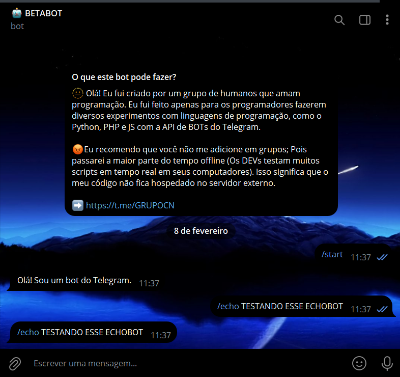

# REQUERIMENTOS VIA ECHOBOT
🤖ECHOBOT SIMPLES DO TELEGRAM PARA VOCÊ APRENDER O QUE É "REQUERIMENTOS".

 <br> <br>
 <br>

## DESCRIÇÃO:
O EchoBot é um bot simples do Telegram desenvolvido em Python que permite aos usuários interagir com ele através do aplicativo Telegram. O bot recebe mensagens dos usuários e responde de acordo com os comandos definidos.

1. **Comando /start**: Quando os usuários iniciam uma conversa com o bot ou enviam o comando `/start`, o bot responde com uma saudação padrão, dando as boas-vindas aos usuários.

2. **Comando /echo**: Os usuários podem enviar uma mensagem para o bot precedida pelo comando `/echo`, e o bot ecoará essa mensagem de volta para o usuário. Isso é útil para testar a funcionalidade básica do bot e verificar se ele está respondendo corretamente.

## [PROPOSITO:](./MINICURSO.md)
O objetivo principal deste projeto não é apenas criar um bot do Telegram, mas sim demonstrar como trabalhar com requisitos em Python. Aqui está uma explicação sobre como isso é alcançado:

1. **Requisitos.txt**: O arquivo `requirements.txt` lista todas as dependências externas necessárias para o projeto. No caso deste bot do Telegram, a única dependência listada é `python-telegram-bot`, que é a biblioteca que permite interagir com a API do Telegram. Esse arquivo é fundamental para garantir que outras pessoas ou sistemas possam facilmente instalar as dependências necessárias para executar o código.

2. **Gerenciamento de Dependências**: Ao incluir o arquivo `requirements.txt`, o projeto adota uma abordagem formal para gerenciar suas dependências. Isso é especialmente útil quando se trabalha em colaboração com outros desenvolvedores ou quando se precisa implantar o código em diferentes ambientes. Com base no arquivo de requisitos, alguém pode simplesmente executar `pip install -r requirements.txt` para instalar todas as dependências necessárias.

3. **Portabilidade do Código**: Ao utilizar o módulo `os` para encontrar o diretório atual e ler o arquivo `token.txt` de lá, o código se torna mais portátil. Isso significa que ele pode ser movido para diferentes diretórios ou ambientes de forma transparente, e ainda assim funcionará corretamente, desde que o arquivo `token.txt` esteja presente no mesmo diretório que o script.

4. **Boas Práticas de Desenvolvimento**: Seguir as práticas recomendadas, como o uso de arquivos de requisitos e tornar o código mais portátil, não apenas simplifica o desenvolvimento, mas também torna o projeto mais robusto e fácil de manter no longo prazo. Isso é especialmente importante à medida que o projeto cresce e evolui ao longo do tempo.

## COMO USAR?
### BAIXANDO O PROJETO:
**Passo 1:** Clone o repositório para o seu sistema local.

```bash
git clone https://github.com/VILHALVA/REQUERIMENTOS-VIA-ECHOBOT.git
```

**Passo 2:** Navegue até o diretório do projeto.

```bash
cd REQUERIMENTOS-VIA-ECHOBOT
```

**Passo 3:** Descompacte o arquivo ZIP (se você baixou manualmente):

```bash
unzip REQUERIMENTOS-VIA-ECHOBOT.zip
```

### EXECUTANDO O PROJETO:
1. **Coloque o Token e Instale os Requirementos:**
   - Antes de executar o programa, é necessário colocar dentro do arquivo `token.txt` o token do bot, o qual pode ser obtido por meio do [@BotFather](https://t.me/BotFather). O bot requer as bibliotecas especificadas no arquivo `requirements.txt`, que podem ser instaladas usando `pip`:
   ```bash
   pip install -r requirements.txt
   ``` 
   
   - Se você não estiver familiarizado com esses passos, confira nosso [curso completo sobre a criação de bots no Telegram](https://github.com/VILHALVA/CURSO-DE-TELEGRAM-BOT) para obter orientações detalhadas.

2. **Inicie o Bot:**
   - Execute o bot do Telegram em Python iniciando-o com o seguinte comando:
```bash
   python CODIGO.py
```

3. **Enviar Comandos**: Os usuários podem enviar comandos para o bot. Por exemplo, enviando `/start`, o bot responderá com a saudação de boas-vindas. Enviando `/echo <mensagem>`, o bot ecoará a mensagem de volta para o usuário.

## SUBSÍDIOS:
- [CLIQUE AQUI PARA ACESSAR AO MINICURSO](./MINICURSO.md)
- [MINICURSO CRIADO PELO VILHALVA](https://github.com/VILHALVA)

